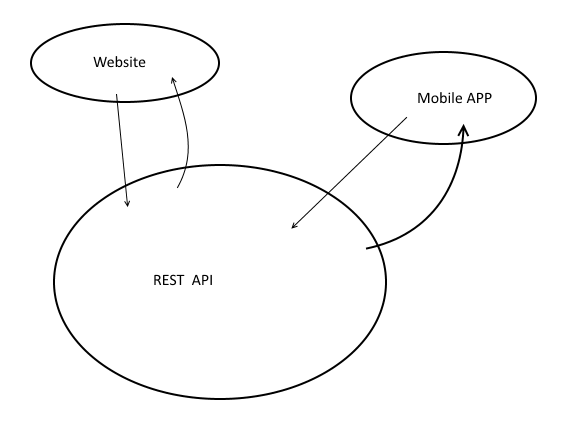
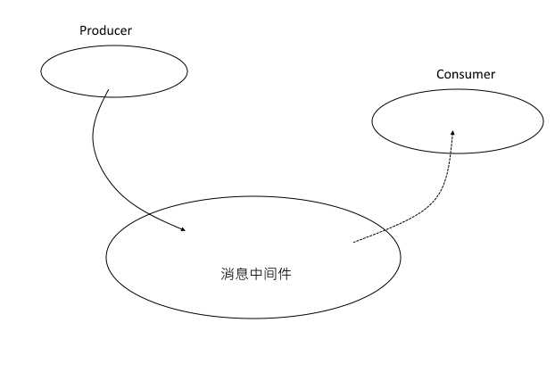

系统架构设计指南(Architecture Guide)
=========================================

系统整体采用 REST 风格架构和 EDA（事件驱动架构）混合形式。未来会将一些服务功能细化，分拆出来独立的服务，向 MicroService 架构发展。

## REST 风格架构 ##

REST 概念最初由 Fielding 博士提出的，请参考[http://www.ics.uci.edu/~fielding/pubs/dissertation/top.htm](http://www.ics.uci.edu/~fielding/pubs/dissertation/top.htm)，作为开发人员和架构师，此文必读。中文翻译版本已经多次修定，可以 [InfoQ 上下载](http://www.infoq.com/cn/minibooks/web-based-apps-archit-design)。

### REST API 设计 ###

相比基于 SOAP 的 Web Service，REST Web Service 回归到 HTTP 本身，利用 HTTP 本身的特性描述 Web Service。

1. URI （统一资源定位器）本身可以定位到某个资源或者资源的集合
2. HTTP 方法 (GET, POST, PUT, DELETE, PATCH) 用于描述对资源的操作
3. HTTP 状态 本身可以描述对一个资源操作的结果

例如，用户管理 API 的设计，`/api/users` 表示用户的集合， GET 操作可以返回所有用户，POST 操作可以向用户集合中添加一个新用户。`/api/users/1`, 可以定位到 ID 为1 的用户，GET 方法可读取用户信息，PUT 可以更新该资料，DELETE 可以进行删除操作。

REST 风格设计简单明了，几乎不需要额外的文档去描述简单的 CRUD 操作，总结如下 。

<table>
    <tr>
        <th>URI</th>
        <th>HTTP 方法</th>
        <th>Request</th>
        <th>Response</th>
        <th>描述</th>
    </tr>
    <tr>
        <td>/api/users</td>
        <td>GET</td>
        <td></td>
        <td>200,
        [{"id":1, "username":"admin", "name":"admin"},{...}]
        </td>
        <td>返回所有用户</td>
    </tr>
    <tr>
        <td>/api/users</td>
        <td>POST</td>
        <td>{"id":1, "username":"admin", "name":"admin"}</td>
        <td>201</td>
        <td>新建用户，成功返回201</td>
    </tr>
    <tr>
        <td>/api/users/1</td>
        <td>GET</td>
        <td></td>
        <td>200,
        {"id":1, "username":"admin", "name":"admin"}
         
        404
        </td>
        <td>返回ID为1 的用户，成功返回200，如果没找到，返回 404</td>
    </tr>
     <tr>
        <td>/api/users/1</td>
        <td>PUT</td>
        <td>{ "username":"admin", "name":"admin"}</td>
        <td>204
        </td>
        <td>更新ID为1 的用户，成功返回204</td>
    </tr>
    <tr>
        <td>/api/users/1</td>
        <td>DELETE</td>
        <td></td>
        <td>204
        </td>
        <td>删除ID为1 的用户，成功返回204</td>
    </tr>
</table>

我们项目将使用开源项目 Swagger 来生成 API 文档，可以在线查询和实时测试。

**项目所有的 REST API 不再一一描述，在 Swagger UI 能够很清楚的看到各 API 细节。**

### REST API 生产者和消费者 ###

REST API 作为规约，用于子系统之间的交互。从功能的角度考虑，可以将系统分为生产者(Producer)和消费者(Comsumer)。

#### 生产者 ####
   
生产者也可以叫 REST 服务器端，用于处理 REST 客户端的请求。对于整个系统而言，服务器负责了整个系统主要业务操作。对外部而言，屏蔽了系统的复杂性，提供系统的安全性保障。

#### 消费者 ####
   
也可以称为 REST 客户端，在所有的子系统中，外部网站，手机APP，后台运营程序都可以设计成 REST 客户端。

### REST 参考资料清单

Fielding 博士论文中文版本：[http://www.infoq.com/cn/minibooks/web-based-apps-archit-design](http://www.infoq.com/cn/minibooks/web-based-apps-archit-design)

[Richardson 成熟度模型](http://martinfowler.com/articles/richardsonMaturityModel.html)，把 REST API 设计定义了三个 Level。我们将严格按 Level 2 设计REST API。

IBM Developer Works 上一篇对 [REST 的简单介绍](http://www.ibm.com/developerworks/cn/webservices/ws-restful/index.html),不错的 REST 入门文档。

简明有效的教程 [REST Cookbook](http://restcookbook.com/)。

## 事件驱动设计 ##

很多场景，客户端不关心服务器能够立即返回结果，可以利用事件方式异步处理，这样能够大提高系统响应。另外，为了应对某些时段的高并发的情况，可以这些高并发任务通过消息的方式分发到其它服务器处理，减轻主服务器压力。

### 消息载体 ###

在基于事件/消息的系统，首先要确认的是事件源或者消息的载体，说白了，就是在服务器要传的消息内容。

### 生产者与消费者 ###

与 REST 架构概念上相似，在基于事件架构中，同样有生产者和消费者，生产者触发事件，负责发布消息，消费者处理接收消息，处理事件。一个子系统可以同时提供生产者和消费者。

## 子系统设计 ##

根据项目需求，性能要求，将系统分为不同子系统，每个子系统将以一个独立的应用程序交付。生产环境中，每个子系统都应该运行在一个独立的服务器上。

### API ###

REST API 主程序，扮演 REST API 生产者，输出 REST API。

### Payment Gateway API ###

从主 REST API 中分拆出来，接收支付网关发送给后台的数据。

### Broker ###

应对高并发情况，如下单等，从消息队列中取出数据处理。

### Job ###

执行定时任务，计算利息，更新状态等。

### Notifier ###

邮件，短信通知程序，接收来自消息队列的数据。

### Console ###

后台运营管事程序，扮演 REST API 消息者。

### 手机APP ###

手机 APP，基于 HTML5/ionic/AngularJS 开发，同时 Android 和 iOS。

## 技术选型 ##

在 Java 企业开发领域，Spring 一直是标准外的选择。但这些年来，Spring 与 Java EE 标准的界线也越来越模糊，Spring 体系越来越庞大，体积也越来越臃肿，而 Java EE 标准领域，由于一些开源厂商的积极参与，Java EE 变得越来越开放，设计上也越来轻巧。

鉴于国内使用 Spring 的开发人员比较多，技术上偏向于选择 Spring 社区产品。系统采用了最新的 Spring 社区成果，同时向最新的 Java EE 7 标准看齐。

### Spring 框架和基础工具 ###

#### Spring 框架 ####

Spring 作为系统基础框架， Spring MVC 作为 REST Producer，Swagger 负责将 REST API可视化（为前端程序提供在线的，可直接测试的，动态更新的 API 参考文档）。

#### MySQL 和 Spring Data JPA ####

采用 Hibernate 4.3/JPA 2.1 作为 Persistence 处理，采用 MySQL 作为作为核心数据库，还会用到 Spring 的子项目 Spring Data JPA。

#### MongoDB 和 Spring Data MongoDB ####

采用 Mongo 数据库，存放图片文件，使用 Spring 子项目 Spring Data MongoDB 操作 MongoDB。

#### Redis 和 Spring Data Redis ####

采用 Redis 作为缓存服务器，使用 Spring 子项目 Spring Data Redis 操作 Redis。

#### RabbitMQ 和 Spring AMQP ####

采用 RabbitMQ 作为消息中间件，使用 Spring 子项目 Spring AMQP 操作 RabbitMQ。

#### Spring Securtiy ####

Spring Security 负责 REST API 安全，使用基于 TOKEN 的机制。

#### Spring Session ####

Spring Session 提供了基于 Redis 的 HTTP Session 实现，与 Spring Security 结合 ，可以实现 TOKEN  在不同应用之间共享。

#### Hibernate 4 ####

项目中主要 JPA 规范操作数据库，采用 Hibernate 作为 JPA Provider。

#### Jackson2 ####

Jackson2 用于转换 REST 客户端和服务器之间的数据。

#### ModelMapper ####

用于转换不同的 Model。

### Java 8 ###

项目使用 Java 8 新的时间 API，即 JSR 310，代替陈旧的 java.util.Date。

### Java EE 7 标准采用 ###

从 Java EE 5 开始，Spring 核心也在一直积极跟进标准新增功能。标准方面，我们跟进了最新的Java EE 标准 Java EE 7。项目中主要会使用以下标准。

#### Servlet 3.1 ####

由 Apache Tomcat 8.0.x 容器提供支持。项目中上传功能也是由 Servlet 3 中的新 API 实现，不依赖第三组件。

#### Bean Validation ####

由 Hibernate Validator 5.1 提供支持。 项目中使用 Bean Valiation 验证客户的请求数据的有效性，另外还可以生成数据库约束。

#### JPA 2.1 ####

由 Hibernate 4.3.8 提供支持。目前使用了 Java 8 中新的时间 API，JPA 2.1 目前还不持这些 API，项目中使用了 JPA 2.1 新增功能 Converter 处理新的时间 API。

####  JSR 330(@Inject) ####

Spring 内置支持， JSR 330 由 Spring 创始人 Johnson 和 Google 的 Guice 框架的创始人 Bob Lee　共同提出的。

### 前端技术 ###

#### AngularJS ####

Google 出品的前端 Javascript 框架。在 console 中， AngularJS 负责与 REST API 交互。之前没接触过 AngularJS的话，必须熟悉 [AngularJS 官网](https://angularjs.org)的首页的四个例子和 Phonecat 那个经典教程。另外 CodeSchool.com 提供的免费视频教程也是不可多得 [AngularJS 入门课程](http://campus.codeschool.com/courses/shaping-up-with-angular-js/)。

#### Bootstrap ####

页面布局使用 [Bootstrap](http://getbootstrap.com)。

## 安全性设计 ##

系统的安全由 REST API 层控制，REST 客户端的请求全部由 REST 服务器校验其合法性。为了后续方便管理 REST API，对 REST API 前缀作了以下规约。

* `/api/public/**` 对所有人都开放
* `/api/mgt/**` 用于后台管理，能够匹配规则的 URI 访问的用户必须是后台用户，有相应后台分配的角色
* `/api/**` 要求用户必须登录
* 其他不作安全控制

对于客户端请求，Spring Security 会根据请求 URI 和相应的 HTTP 方法按这个顺序逐一排查。

## 杂项 ##

### 软删除(Soft Deletion) ###

原则上讲，系统所有的业务数据都不应该被人工物理删除。

1. 关系型数据库之间都建立了强关联关系，如果删除一个处于树形结构顶端的数据，势必牵扯到所有关联网络中的所有数据。
2. 所有的历史业务数据，包含被“删除”的数据也同样有统计分析价值。
3. 删除的数据应该是可以恢复，以防止数据误删除。

在设计时，一些核心的业务数据实体类都有一个字段来标志是否删除，可以很好的解决这些问题。

执行删除数据操作，不会进行物理删除，只更新删除状态。

后台运营管理系统中，仍可以查询到已经被“删除”的数据，而在外部网站，手机APP程序中，查找一条已经标志为“删除”的数据结果应该是找不到，效果和真实物理删除一样。用户，订单，产品，等都有一个 active 标志。